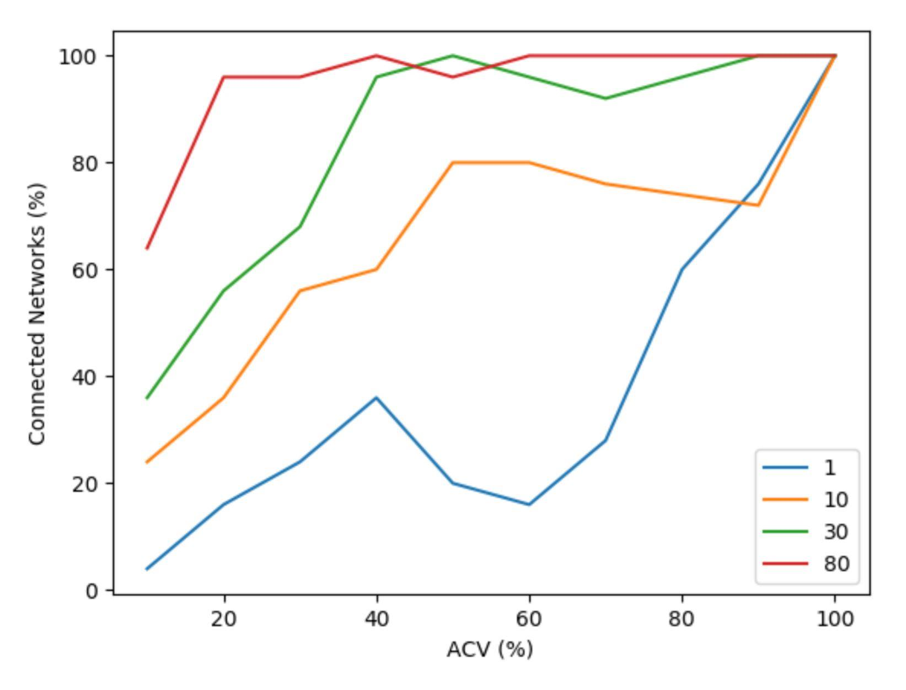
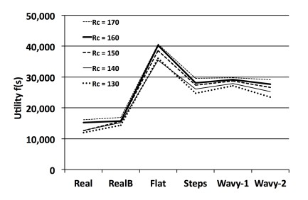
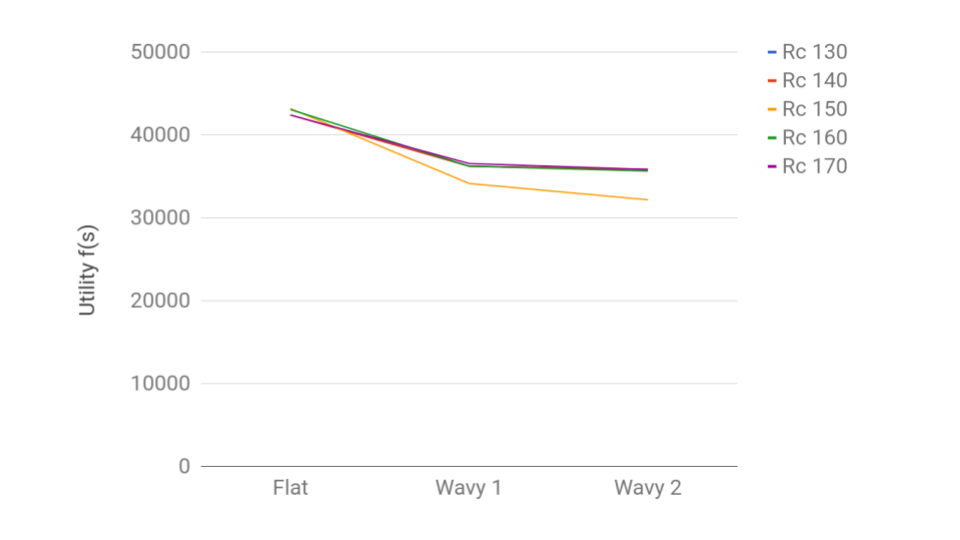

# Introduction

The ability to reproduce previous experiments is one of the most 
important aspects in scientific research. However, as scientific 
discovery is rapidly advancing, researchers are pressured to rush 
publication of new findings and breakthroughs. This is especially true 
in computer science and engineering where knowledge and technology 
have been advancing overwhelmingly fast and the push to publish new 
results is even stronger. Lately, however, there has been growing 
concern in this community about results that cannot be reproduced and 
thus cannot be verified [@kurose_2016]. There is increasing consensus 
about the importance of being able to reproduce research results to 
better understand conveyed ideas and further improve upon them. 
Computer networks research is not the exception and this community has 
also been paying attention to the issues of reproducibility in this 
domain [@bajpai_encouraging_2019].

In addition to validating the credibility of scientific papers and 
their results, reproducing networking experiments has also been used 
as a hands-on way to teach both fundamental and advanced concepts in 
computer networking [@yan2017learning]. When teaching a new topic, 
educators want students to engage in the particular subject matter 
rather than the daunting task of setting up an environment. This 
educational aspect could be improved by using a tool that would enable 
students and educators to easily create and modify end-to-end 
workflows to make learning more accessible to students. Another 
motivation behind making the case for experimental reproducibility in 
networking research is based on our own experience as members of an 
academic research lab. Often times junior students help and eventually 
may take over the work of more senior students who are soon graduating 
or have already left the university. Instead of reinventing the wheel, 
it is in the interest of the lab for the new students to improve and 
build on top of previous work while leveraging as much of it as 
possible.

One of the biggest setbacks in reproducing results is the complexity 
that comes with rebuilding the same environment in which the original 
experiment was conducted. Most of experiments in the field of computer 
networks rely on expensive hardware, deep software stacks and complex 
configuration setups. In this paper, we make the case for a systematic 
approach to experimental reproducibility by making use of 
reproducibility tools. A recently proposed reproducibility tool named 
Popper introduces a convention for creating experimentation pipelines 
which are easy to reproduce and validate [@jimenez_2017_popper]. In 
order to show the suitability of the Popper convention in the 
experimental networking domain, we document our experience of 
automating the two network simulation experiments presented in 
[@mansfield_2016 ; @veenstra_2015]. One of the main reasons we chose 
these two papers was because we had the help of the original authors 
available to us. This paper details our experience with the goal of 
serving as a reference to other researchers seeking a way to make 
their experiments reproducible.  In addition, we briefly present two 
additional Popper workflows for running experiments on experiment 
testbeds and studies that gather real-world metrics. The code for 
these workflows available on Github. The contributions of our work 
include:

  * Applying Popper in the domain of computer networks.
  * A methodology template for others to create reproducible 
    experiments in the three broad categories of networking studies: 
    simulations, testbeds and real-world measurements.
  * A list of lessons learned and best practices that we have 
    identified, and that other researchers can use as a reference.

The remainder of the paper is organized as follows, Section 2 gives a 
brief introduction to Popper, the tool that is used to help make 
networking experiments reproducible. In Section 3, we describe the 
networking experiments that we reproduce using Popper as well as the 
network simulation platform we use, while in Section 4, we describe 
how each experiment was conducted originally, i.e., prior to using 
Popper's reproducibility model. Section 5 presents experimental 
results under Popper and compares them with original results. Section 
6 describes briefly the workflows that correspond to experimental 
testbeds and to real-world measurement gathering. Lastly, in Section 
7, we reflect on our experience and provide a list of lessons learned 
that we hope will help other practitioners working networking 
experiments.

# Popper {#sec:popper_tool}

Popper is a convention for creating reproducible scientific articles 
and experiments [@jimenez_2017_popper_ci]. The convention is based on 
the open source software (OSS) development model, using the DevOps 
approach to implement different stages of execution. The Popper 
Convention creates self-contained experiments that do not rely on 
libraries and dependencies other than what is already inside the 
Popper-compliant or "Popperized" experiment. To achieve 
reproducibility, Popper uses pipelines containing shell scripts that 
execute the original experiment. An example of set of steps that an 
experimenter can follow to help achieve reproducibility are the 
following:

 1. Experimental design and workflow definition.
 2. Selection of tools (including hardware) for the study.
 3. Packaging of software environment using portability tools such as 
    Virtualenv, Docker, Vagrant, etc.
 4. Creation of experiment scripts and parameter sweeps.
 5. Creation of analysis scripts using data analysis tools such as 
    Pandas or R.

The Popper pipeline consists of five stages: setup, run, post-run, 
validate, and teardown. In the `setup` stage, the workflow would 
usually download all the necessary software to run the experiment. 
These files are, for example, data files, libraries, and other 
dependencies. This stage can also be in charge of allocating resources 
on a testbed. The `run` stage executes the script that is used to run 
the original experiment. The `post-run` stage is where a user would 
implement the post-processing of results obtained in the run stage. 
This stage could be used to open a log file that shows the results of 
the experiment or run a script that graphs and displays the results. 
The `validate` phase is where experimenters would implement code that 
automatically check the claims being made in their study. Lastly, the 
`teardown` phase might be used to release resources that were 
allocated on a remote testbed. We note that each experiment may vary 
and that not all stages are needed for every experiment (and they can 
also be named differently).

In our case, for example, the simulation experiments we reproduced 
were made to run in a virtual environment called Instant Contiki. For 
this reason, we needed a Popper pipeline that could run a Linux 
operating system. To achieve this, we used Docker, a DevOps tool that 
packages applications and environments into containers. Docker allowed 
us to create an image of the Contiki operating system that contained 
all the libraries and dependencies needed to run it as just one 
package inside our pipeline. This feature of Popper that allows the 
use of DevOps tools and does not strictly require the use of any 
particular tool, makes it an advantageous convention, which we will 
demonstrate in the sections that follow.

# Network Simulation Experiments {#sec:network}

In this section we do a brief survey of existing simulation platforms 
([@Sec:simulators]). We then describe two published studies that we 
have reproduced ([@Sec:studies]), followed by an explanation of the 
Popper pipelines that we obtained ([@Sec:popperization]). We then 
report on the results ([@Sec:results]). The code for this pipelines, 
which can be used by researchers as a starting point for their 
studies, can be found at 
<https://github.com/msouppe/cmpe257_mobile_networks>.

## Network Simulation Platforms {#sec:simulators}

There are a variety of network simulation platforms such as NS3, 
MiniNet, and Cooja. NS3 [@ns3] is an open source discrete event 
network simulator that is widely used for simulation environments for 
network research. Its goal is to provide scalability and ease of use 
for a variety of networks. Mininet [@mininet] is also an open source 
simulation tool that provides a virtual network for interacting with 
Software-Defined Networking applications using OpenFlow. Cooja 
[@cooja] is a widely used network simulation platform that is 
specialized in evaluating wireless sensor network applications. Cooja 
is a simulation tool for the Contiki open source operating system, 
which is used for building and connecting wireless systems for the 
Internet of Things [@cooja]. Although each of these network simulators 
is a popular choice in the networking field, the experiments we are 
working with are conducted in Cooja, as it allows for inclusion of 
simple radio propagation models.

## Studies Reproduced In This Paper {#sec:studies}

### TerrainLOS

The first experiment we have reproduced in this paper is based on 
TerrainLOS [@mansfield_2016]. TerrainLOS is an outdoor terrain 
propagation model that aims to create a more accurate simulation of 
outdoor sensor network communication. Most simulation platforms either 
assume a completely flat terrain or tend to use very simplistic 
channel propagation models that do not represent realistic outdoor 
terrain conditions. To present a more accurate outdoor simulation 
model, TerrainLOS uses common geographical height maps, called Digital 
Elevation Models (DEMs). These data files are used in experimental 
evaluations to investigate communication between nodes under realistic 
conditions. TerrainLOS defines Average Cumulative Visibility (ACV) as 
a metric to characterize terrain. ACV denotes the average percentage 
of nodes that are visible in an area from all nodes on a map. For 
example, 100% ACV means that every node is visible to all other nodes, 
which further implies the presence of a flat terrain. In their 
experimental methodology, the authors of TerrainLOS define population 
as the percentage of nodes per location on a given map, e.g., a 
population of one means there is one node for every one hundred 
locations on the map. The ACV and the population metrics are used in 
evaluating network connectivity. Our experiments in this paper focus 
on automating the execution and re-execution of Experimental 
Connectivity simulation in [@mansfield_2016]. The purpose of this 
simulation is to experimentally evaluate the accuracy of connectivity 
results based on the models earlier presented by the authors in 
[@mansfield_2016]. The connectivity results are plotted using the 
Average Cumulative Visibility metric and population size.

### Sensor Network Deployment Over 2.5D Terrain

TerrainLOS has been used to evaluate the sensor placement algorithm 
proposed in [@veenstra_2015] that aims at optimizing visual coverage 
in deployments over 2.5D terrain. 2.5D terrain is defined as using 
2-dimensional rendering techniques such as the sensor placement 
algorithm and using controls in 3-dimensional space such as the 
terrains. It is named 2.5D terrain as it is not quite 3-dimensional 
but it is using features of 2-dimensions and 3-dimensions. The 
proposed algorithm works as follows. Initially, a set of nodes is 
placed on a given region. Then, each node executing the algorithm 
moves around the terrain to optimize the collective visibility of the 
network. In the original paper, each new run of the experiment 
involved initializing a script with parameters such as number of 
nodes, intended transmission range of the nodes, and the desired 
terrain, then running the script, analyzing the results, and repeating 
these steps multiple times until the results are reasonable.

Additionally, the experiment in the paper required pre-installing an 
associated program containing a graphical user interface (GUI) that 
required familiarity with its features from the user. After extensive 
manual configuration and initialization of the parameters mentioned 
above, running the script and waiting for the final results was a 
repetitive and time-consuming task. Since each new experiment had to 
be configured and re-run a number of times for accurate results, the 
student or researcher had to be present in front of their computer 
throughout the duration of the process. Finding a way of automating 
this process and avoiding using a GUI was imperative.

## Reconstructing Experiments Using Popper {#sec:popperization}

### TerrainLOS

TerrainLOS is intended to run in Cooja, the network simulator for the 
Contiki operating system. In order to run TerrainLOS, without using 
Popper, a researcher would have to go through several steps when 
attempting to replicate the results in [Sam’s Paper]. First, they 
would have to download Instant Contiki, a development environment for 
the Contiki operating system, and install a virtual machine to run it. 
Once the user has logged in and started the Cooja simulator, they 
would have to download the necessary files, libraries, and 
dependencies needed to run the TerrainLOS propagation model. Lastly, 
they would have to create a jar file of TerrainLOS and load it into 
Cooja to run the simulations. This is a very time-consuming task, not 
to mention the very likely possibility of encountering errors upon 
attempting to run the project the first time. Similarly to our 
experience, the researchers or the reviewers of the project may find 
that after compilation there are a few necessary files or modules 
missing that were not part of the set-up instructions provided by the 
authors. However, opposed to our particular case, reviewers rarely 
have a chance to contact the original author of the experiment and 
receive step-by-step instructions or solutions to the encountered 
errors. For this reason, interpreting error messages is generally 
cumbersome if not impossible.

Popper provides a significantly more effortless way to reproduce 
someone’s experiment without the need of having the original author 
explain the steps needed for the procedure. Usually, the author would 
tailor their code in a way that follows the Popper convention from the 
start. However, making an experiment Popper compliant in retrospect is 
possible as well. We want to show this by detailing the steps taken to 
make Experimental Connectivity simulation of TerrainLOS Popper 
compliant.

First, in the implementation of the Popper pipeline, two stages were 
generated – the run stage and the post-run stage. Although in this 
particular experiment the setup, validate, and teardown stages were 
not used, the workflow for other experiments may differ. In our 
pipeline, the run stage takes care of setting up the Instant Contiki 
and Cooja environment. Since Instant Contiki requires a virtual 
machine to run and Cooja is usually used with a GUI, the setup of the 
two was accomplished with the help of Docker containers. Docker 
creates an image of the Contiki operating system including the Cooja 
simulator. Once the virtualization of the Contiki system is finished, 
the main task of the run stage is to execute the author’s script that 
takes ACV and population size as inputs. The original simulation 
experiment was run using population sizes of one, ten, thirty, and 
eighty, and ACVs ranging from one to hundred percent with increments 
of ten. The same input arguments are used for the reproduced 
experiment as well. After the script has been executed, the output of 
these runs is saved in log files, which are read in the post-run stage 
with another script written by the author. The results are then 
graphed and saved in an image file as output. As a result, the 
original experiment is “Popperized” and can be run by just simply 
executing the `popper check` command inside the experiment pipeline.

### Sensor Network Deployment Over 2.5D Terrain

When first running the experiment [@veenstra_2015], there were a few 
tools that had to be downloaded before getting the experiment to work. 
Java and Contiki had to be installed since those are the environments 
where the experiment runs. Once the environment was set up, the code 
for the experiment would run in Cooja. Then for every experiment to be 
run, a simulation file had to be configured per experiment manually. 
This part of the process can be very lengthy since each simulation 
contains numerous different parameters. After each simulation script 
has been configured, each script could be run within the simulator, 
then after a certain amount of time the final Cumulative Visibility 
value is obtained. In the Popperized version of the experiment, there 
are two stages in the pipeline - the setup stage and run stage. The 
setup stage builds a Docker container which creates the necessary 
environment for the experiment to run. Additionally, the setup stage 
creates simulation scripts for every experiment the user would like to 
run. In the run stage, each of the scripts that have been made from 
the setup stage are now run in the Cooja simulator.

Furthermore, in the Popper version the user only has to configure one 
file for multiple simulations where popper will run each simulation 
individually and then output the final results. The automated workflow 
for this simulation is as follows; first, the values of the parameters 
of the experiment have to be defined by the user. Second, a Docker 
container is created with the entire environment, modules, and 
packages for the experiment to run. In the third step, the simulation 
template gets pulled, from the pipeline created from the popper tool, 
and the fourth step creates N simulations that the user has defined. 
Fifth, those N simulations are run and lastly the Cooja.testlog are 
outputted into the output folder to further evaluate the final result. 

## Results {#sec:results}

### TerrainLOS

The simulation experiment titled Experimental Connectivity in 
[@mansfield_2016] outputs a graph depicting the percentage of 
connected networks based on Average Cumulative Visibility and 
population size. This graph can be seen in Figure 2. Intuitively, 
population size of 80 has the highest percentage of connected networks 
from ACV ranging from zero to hundred percent. The authors of 
[@mansfield_2016] explain that this is because a larger population can 
bypass obstacles in the terrain (e.g., mountain) more likely than a 
smaller population. For this reason, the percentage of connected 
networks drop as the populations size decreases.

In our reproduced experiment output, depicted in Figure 3, a similar 
graph is seen. The reproduced experiment is not an exact copy of the 
original. This is because the experimental simulation outputs for 
Experimental Connectivity are intended to be probabilistic and vary 
across multiple runs. It is possible to generate the exact graph using 
the original simulation logs from the author, but we wanted to 
showcase the re-execution of the pipeline from the start of the 
experiment. We still observe the general trend in the reproduced 
results. Population size of 80 produces the highest percentage of 
connected networks. Furthermore, as population size decreases, the 
percentage of connected networks decrease as well. This trend 
indicates a successful reproduction of the experiment.

![Original results from the Experimental Connectivity experiment in [@mansfield_2016].](figures/sam_old.jpg){#fig:old_sam}

{#fig:new_sam}

### 2.5D Deployment on TerrainLOS

{#fig:origin_veenstra}

{#fig:new_veenstra}

Similar to Experimental Connectivity, the results of [@veenstra_2015] 
are obtained in a form of a graph. The output of the original paper 
can be seen in Figure 4, while the output of our reproduced experiment 
is shown in Figure 5. Figure 4 shows results for every data point 
calculated for the average of ten nodes in random starting positions 
on specified terrain [@veenstra_2015]. Furthermore, the graph 
illustrates each communication radius from 130 to 170 with increments 
of ten for the given terrains.

In the graph in Figure 5, we can see that the outputs are not exactly 
the same. Some of the reproduced results do not have all of the 
terrains as in the original results because not all of the terrains 
were available while reproducing the experiment. Furthermore, the 
values in Figure 5 are higher than the values in Figure 4. This 
difference is because the original paper used a custom, synchronous 
simulator that was programmed in C++. Since then, the author of the 
experiment decided to switch environments. For this reason, the 
experiment has been translated into a Cooja environment as a new Java 
model in the event-driven simulator. Despite missing elements, due to 
the author’s decision, the trend in both Figure 4 and Figure 5 is 
uniform.

# Controlled and Real-world Experiments {#sec:other-workflows}

In this section we briefly describe two Popper pipelines showcasing 
network experiments on testbeds and in real-world scenarios. These can 
be found in the repository corresponding to this paper. Our goal is to 
provide pipelines that can serve as the starting point for 
experimenters that are working on these networks research subdomains.

## Experiments on Testbeds

Multiple testbeds are available. In our case, we make use of the 
NSF-sponsored GENI federation of datacenters in the US. This 
infrastructure provides with a wide variety of compute, storage and 
networking hardware, including traditional, IoT and city-scale 
wireless devices. The most time-consuming stages of a pipeline 
involving the use of a testbed are (1) the setup stage, where 
resources are allocated; and (2) the experiment "orchestration" phase, 
where the logic of the experiment is executed. The pipeline we have 
implemented makes use of Geni-lib and Ansible to accomplish these two 
tasks. These two automation frameworks are generic and allow the 
execution of arbitrary network topologies, as well as the execution of 
benchmarks and protocol tests.

## Real-world Measurements

The real world is complex, and capturing measurements helps understand 
researchers to make sense out of all this complexity. This type of 
studies usually involves the deployment of nodes that test intra- and 
inter-domain features such as internet protocol performance. One of 
the most important aspects of this type of experiments is the 
collection of contextual information that might help readers and 
reviewers to interpret and verify the claims. Information such as 
which service provider is being used, physical location of endpoints, 
type of networks being used, among others. The pipeline we have 
implemented deploys a client-server setup, runs tests and captures all 
this information automatically.

# Lessons Learned {#sec:lessons}

Recent studies have identified good practices that can (and should) be 
followed in order to ease the re-execution of published networking 
experiments [@bajpai_dagstuhl_2019]. In addition to these, coming from 
a practical angle, we identify the following:

 1. _Reproducibility as a first-class issue_. One of the main 
    takeaways that we learned is the difficulty involved in automating 
    an experiment that was not implemented with reproducibility in 
    mind. In our case, we had the opportunity to closely work with the 
    original authors of the network experiments. However, having 
    access to the original authors is quite uncommon. Even with the 
    opportunity of consulting with the authors, reproducing their 
    experiment was an extensive task as they have made a few changes 
    to their work since publication. This further shows how focusing 
    on reproducibility from the start (e.g., using the Popper 
    convention or other reproducibility tools) makes it easier to 
    obtain a versioned, automated, and portable pipeline that others 
    can easily re-execute. This finding, among others related to 
    Popper best practices have been documented in 
    [@sevilla_popper_2018].
 2. _Use a workflow automation tool_. Compared to workflows specified 
    in scientific workflow engines such as Taverna or Pegasus, Popper 
    workflows are relatively simple. One could describe Popper 
    workflows as the highest-level workflow of a scientific 
    exploration, which users or automation services interact with. 
    Other alternative tools that can be used for this are CWL, Yadage, 
    CK, among others.
 3. _Make experiments self-contained_. Automating an experiment does 
    not necessarily result in creating self-contained experiments. A 
    useful check for verifying whether an experiment is self-contained 
    is to start from a clean-slate environment (e.g. a base OS Docker 
    image), clone the repository that holds the pipeline, and run it. 
    If something fails, then the experiment is not self-contained.
 4. _Expose relevant experiment parameters_. Once an experiment is 
    successfully re-executed, the likely next step of a reviewer and 
    readers is to ask "what-if" types of questions. For example, "what 
    if I modified the number of nodes in the system?" or "what if I 
    modified the amount of memory available to the experiment?". In 
    order to make it easier for consumers of published research to 
    "play" with experiments, researchers can expose in plain text 
    format (e.g. a YAML file in the folder where the pipeline is 
    stored) that clearly exposes the parameters that the experiment is 
    sensible to.
 5. _Capture relevant information for post-mortem analysis_. When an 
    experiment fails, the first question we ask ourselves is: "what 
    has changed, between my re-execution and the previous successful 
    reproduction of results?". In order to make it easier for others 
    to answer this question, we should attempt, on a best-effort 
    basis, to collect as much contextual information as possible so 
    that it can be leveraged by others (or ourselves) to apply this 
    type of root cause analysis.

# Conclusion {#sec:conclusion}

Experimental reproducibility is an essential component of scientific 
research. However, unlike other disciplines in the sciences, 
reproducing experimental results in the field of computer science and 
engineering has not been part of common practice for a number of 
reasons. This includes the fact that it is a fast evolving field and 
re-creating the original experimental environment from the ground up 
is often too complex and sometimes impossible. In this paper, we 
reported our experience using a recently proposed tool called Popper 
which employs a systematic approach to automating the experimental 
process, including experimental setup, (re-)execution, data analysis, 
and visualization. We showcase how Popper can be used to facilitate 
experimental reproducibility in the experimental computer networking 
domain. We hope our work will provide a workflow template to guide 
network researchers and practitioners towards making experimental 
reproducibility part of the best practices in the field.

**Acknowledgements**: This work was partially supported by NSF Grants 
No. OAC-1450488, OAC-1836650, and the Center for Research in Open 
Source Software (<https://cross.ucsc.edu>).

# References {.unnumbered}

\noindent
\vspace{-1em}
\setlength{\parindent}{-0.18in}
\setlength{\leftskip}{0.2in}
\setlength{\parskip}{0.5pt}
\fontsize{7pt}{8pt}\selectfont
