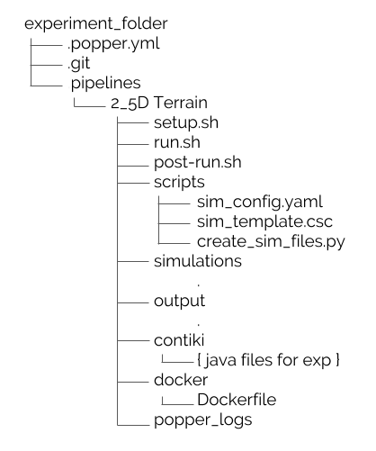

# Introduction
The ability to reproduce previous experiments is one of the most important aspects in scientific research. However, as scientific discovery is rapidly advancing, researchers are pressured to rush publication of new findings and breakthroughs. This is especially true in Computer Science and Engineering where knowledge and technology have been advancing overwhelmingly fast and the push to publish new results is even stronger. Lately, however, there has been growing concern in the experimental computer science and engineering research community about results that cannot be reproduced and thus cannot be verified [@kurose_2016]. 

There is increasing consensus about the importance to be able to reproduce existing research paper results to better understand conveyed ideas and further improve upon them. 

The remainder of the paper is organized as follows, @Sec:motiv, goes over the motivation in the reproducibility field. @Sec:popper_tool goes over the tool that is used to help make these simulation experiments reproducible. In @Sec:network, we describe the networking experiments that we reproduce using Popper as well as the network simulation platform we use, while in @Sec:popperization, we describe how each experiment was conducted originally, i.e., prior to using Popper's reproducibility model. @Sec:results presents experimental results under Popper and compares them with original results. Lastly, in @Sec:lessons, we reflect on our experience and provide a list of lessons learned that we hope will help other practitioners producing this type of networking experiments.

# Motivation {#sec:motiv}
Replicating scientific experiments is a challenging task. In experimental computer science and engineering, more generally, and in computer networking, more specifically, one of the biggest setbacks of reproducibility is the complexity that comes with rebuilding the same environment in which the original experiment was conducted [@jimenez_2017_popper_ci]. Many experiments in this field rely on expensive hardware and software. While simulation tools give us an advantage over the dependency of using hardware, rerunning an experiment from scratch can be strenuous. Simulations experiments often come with the cost of extensive configuration and software installation is needed when attempting to reproduce the results. In addition, even with a correct setup there might still exist an uncertainty whether the results are reproduced correctly. 

Our motivation behind this paper was our interest in reproducibility due to its challenging nature. It is a common scenario in both undergraduate and graduate research labs for novice students to take over the work of more senior students who are soon graduating or have already left the university. Instead of reinventing the wheel, it is in the interest of the lab for the new students to improve and build on top of previous work while leveraging as much of it as possible. However, replicating someone else’s work is challenging and often impossible. This is especially prevalent in computer networking experiments where most of the experiment setup is performed manually with little or no documentation. The current state of practice of setting up simulation experiments for students and researchers involves obtaining and keeping track of large amount of data from various datasets, installing software setting up an environment, and downloading libraries and dependencies necessary. These steps are often left undocumented.

We have chosen [@mansfield_2016 ; @veenstra_2015] in order to show the suitability of Popper in the networking domain. We got in contact with the original authors [@mansfield_2016 ; @veenstra_2015] and obtained all original scripts to reproduce their existing experiments. Additionally, we met with the authors several times to understand how the scripts map to what is reported in the original paper. Then, we went ahead and started “popperizing” the experiments, going back to the authors as needed, as we had direct access to them. 

# Popper {#sec:popper_tool}
Popper is a convention for creating reproducible scientific articles and experiments [@jimenez_2017_popper].  The convention is based on the open source software (OSS) development model, using the DevOps approach to implement different stages of execution. The Popper Convention creates self-contained experiments that do not rely on libraries and dependencies other than what is already inside the “popperized” experiment. To achieve reproducibility, Popper uses pipelines that contains shell scripts that execute the original experiment. @Fig:popper shows an example Popper pipeline from one of the Popper lessons.

{#fig:popper}

The Popper pipeline consists of a few stages: the setup, run, post-run, and optional validate and teardown stage. In the setup stage, a user would usually download all the necessary files to run the project. These files are, for example, data files, libraries, and other dependencies. The run stage executes the script that is used to run the original experiment. The post-run stage is where a user would display the results obtained in the run stage. This stage could be used to open a log file that shows the results of the experiment or run a script that graphs and displays the results.

In the case of our experiments, we needed to run an entire operating system. To achieve this Docker, a DevOps tool that packages applications and environments into containers, was used. This allowed us to create an image of the operating system that contained all the libraries and dependencies needed to run it as just one package. This feature of Popper that allows the use of DevOps tools makes it a very useful convention, as it is demonstrated in the next sections.

# Network Simulation Experiments {#sec:network}

## Network Simulation Platforms 

There are a variety of network simulation platforms such as NS3, MiniNet, and Cooja. NS3 [@ns3] is an open source discrete event network simulator that is widely used for simulating environments for network research. Its goal is to provide scalability and ease of use for a variety of networks. Mininet [@mininet] is also an open source simulation tool that provides a virtual network for interacting with Software-Defined Networking applications using OpenFlow. Cooja [@cooja] is a widely used network simulation platform that is specialized in evaluating wireless sensor network applications. Cooja is a simulation tool for the Contiki open source operating system, which is used for building and connecting wireless systems for the Internet of Things [@cooja]. Although each of these network simulators is a popular choice in the networking field, the experiments we are working with are conducted in Cooja, which allows for inclusion of simple radio propagation models.

## TerrainLOS
The first experiment we have reproduced in this paper is based on TerrainLOS [@mansfield_2016]. TerrainLOS is an outdoor terrain propagation model that aims to create a more accurate simulation of outdoor sensor network communication. Most simulation platforms either assume a completely flat terrain or tend to use very simplistic channel propagation models that do not represent realistic outdoor terrain conditions. To present a more accurate outdoor simulation model, TerrainLOS uses common geographical height maps, called Digital Elevation Models (DEMs). These data files are used in experimental evaluations to investigate communication between nodes under realistic conditions. TerrainLOS defines Average Cumulative Visibility (ACV) as a metric to characterize terrain. ACV denotes the average percentage of nodes that are visible in an area from all nodes on a map. For example, 100% ACV means that every node is visible to all other nodes, which further implies the presence of a flat terrain. In their experimental methodology, the authors of TerrainLOS define population as the percentage of nodes per location on a given map, e.g., a population of one means there is one node for every one hundred locations on the map. The ACV and the population metrics are used in evaluating network connectivity. Our experiments in this paper focus on automating the execution and re-execution of “Experimental Connectivity” simulation in [@mansfield_2016]. The purpose of this simulation is to experimentally evaluate the accuracy of connectivity results based on the models earlier presented by the authors in [@mansfield_2016]. The connectivity results are plotted using the Average Cumulative Visibility metric and population size. 

## Sensor Network Deployment Over 2.5D Terrain 
TerrainLOS has been used to evaluate the sensor placement algorithm proposed in [@veenstra_2015] that aims at optimizing visual coverage in deployments over 2.5D terrain. The proposed algorithm works as follows. Initially, a set of nodes is placed on a given region. Then, each node executing the algorithm moves around the terrain to optimize the collective visibility of the network. In the original paper, each new run of the experiment involved initializing a script with parameters such as number of nodes, intended transmission range of the nodes, and the desired terrain, then running the script, analyzing the results, and repeating these steps multiple times until the results are reasonable. 

Additionally, the experiment in the paper required pre-installing an associated program containing a graphical user interface (GUI) that required familiarity with its features from the user. After extensive manual configuration and initialization of the parameters mentioned above, running the script and waiting for the final results was a repetitive and time-consuming task. Since each new experiment had to be configured and re-run a number of times for accurate results, the student or researcher had to be present in front of their computer throughout the duration of the process. Finding a way of automating this process and avoiding using a GUI was imperative. 

# Reconstructing Experiments Using Popper {#sec:popperization}

## TerrainLOS
TerrainLOS is intended to run in Cooja, a network simulator for the Contiki operating system. In order to run TerrainLOS, without using Popper, a researcher would have to go through several steps when attempting to replicate the results in [@mansfield_2016]. First, they would have to download Instant Contiki, a development environment for the Contiki operating system, and install a virtual machine to run it. Once the user has logged in and started the Cooja simulator, they would have to download the necessary files, libraries, and dependencies needed to run the TerrainLOS propagation model. Lastly, they would have to create a jar file of TerrainLOS and load it into Cooja to run the simulations. This is a very time-consuming task, not to mention the very likely possibility of encountering errors upon attempting to run the project the first time. Similarly to our experience, the researchers or the reviewers of the project may find that after compilation there are a few necessary files or modules missing that were not part of the set-up instructions provided by the authors. However, opposed to our particular case, reviewers rarely have a chance to contact the original author of the experiment and receive step-by-step instructions or solutions to the encountered errors. For this reason, interpreting error messages is generally cumbersome if not impossible. 

Popper provides a significantly more effortless way to reproduce someone’s experiment without the need of having the original author explain the steps needed for the procedure. Usually, the author would tailor their code in a way that follows the Popper convention from the start. However, making an experiment Popper compliant in retrospect is possible as well. We want to show this by detailing the steps taken to make “Experimental Connectivity” simulation of TerrainLOS Popper compliant. 

First, in the implementation of the Popper pipeline, two stages were generated – the run stage and the post-run stage. Although in this particular experiment the setup, validate, and teardown stages were not used, the workflow for other experiments may differ. In our pipeline, the run stage takes care of setting up the Instant Contiki and Cooja environment. Since Instant Contiki requires a virtual machine to run and Cooja is usually used with a GUI, the setup of the two was accomplished with the help of Docker containers. Docker creates an image of the Contiki operating system including the Cooja simulator. Once the virtualization of the Contiki system is finished, the main task of the run stage is to execute the author’s script that takes ACV and population size as inputs. The original simulation experiment was run using population sizes of one, ten, thirty, and eighty, and ACVs ranging from one to hundred percent with increments of ten. The same input arguments are used for the reproduced experiment as well. After the script has been executed, the output of these runs is saved in log files, which are read in the post-run stage with another script written by the author. The results are then graphed and saved in an image file as output. As a result, the original experiment is “popperized” and can be run by just simply executing the “popper check” command inside the experiment pipeline. 

## Sensor Network Deployment Over 2.5D Terrain 
When first running the experiment [@veenstra_2015], there were a few tools that had to be downloaded before getting the experiment to work. Java and Contiki had to be installed since those are the environments where the experiment runs. Once the environment was set up, the code for the experiment would run in Cooja. Then for every experiment to be run, a simulation file had to be configured per experiment manually. This part of the process can be very lengthy since each simulation contains numerous different parameters. After each simulation script has been configured, each script could be run within the simulator, then after a certain amount of time the final Cumulative Visibility value is obtained. In the Popperized version of the experiment, there are two stages in the pipeline - the setup stage and run stage. The setup stage builds a Docker container which creates the necessary environment for the experiment to run. Additionally, the setup stage creates simulation scripts for every experiment the user would like to run. In the run stage, each of the scripts that have been made from the setup stage are now run in the Cooja simulator. 

Furthermore, in the Popper version the user only has to configure one file for multiple simulations where popper will run each simulation individually and then output the final results. The automated workflow for this simulation is as follows; first, the values of the parameters of the experiment have to be defined by the user. Second, a Docker container is created with the entire environment, modules, and packages for the experiment to run. In the third step, the simulation template gets pulled, from the pipeline created from the popper tool, and the fourth step creates N simulations that the user has defined. Fifth, those N simulations are run and lastly the Cooja.testlog are outputted into the output folder to further evaluate the final result. 

# Results {#sec:results}

## TerrainLOS
The graph of the Experimental Connectivity experiment depicts the percentage of connected networks based on Average Cumulative Visibility and population size [@mansfield_2016].

![Original results from the Experimental Connectivity experiment in [@mansfield_2016].](figures/sam_old.jpg){#fig:old_sam}

{#fig:new_sam}

@Fig:old_sam shows the results of the original experiment. The reproduced experiment does not match the original results exactly, as seen in @Fig:new_sam. This is due to the fact that the experimental outputs for Experimental Connectivity are probabilistic and vary across multiple runs. Additionally, the original experiment results were obtained from a combination of five runs, which resulted in a smoother graph. The reproduced results, on the other hand, were obtained from only one run. Although no results are going to produce the exact outcome from the original experiment, we still observe the general trend in the reproduced experiment. 

## 2.5D Deployment on TerrainLOS
{#fig:origin_veenstra}

{#fig:new_veenstra}

The resulting graphs both show results for every data point is calculated for the average of ten nodes in random starting positions on specified terrain [@veenstra_2015]. Furthermore, the graph illustrates each communication radius from 130 to 170 with increments of ten for the given terrains.

In @Fig:origin_veenstra and @Fig:new_veenstra we can see that the results are *not* exactly the same. Some of the reproduced results do not have all of the terrains as in the original results because not all of the terrains were available while reproducing the experiment. Furthermore, the values in @Fig:new_veenstra are higher than the values in @Fig:origin_veenstra. This difference likely is because the original paper used a custom, synchronous simulator that was programmed in C++. Since then the experiment has been translated into a Cooja environment as a new Java model in the event-driven simulator by the choice of the author [@veenstra_2015]. The main take away from these results, despite some missing elements and due to the change in environment, there is a common trend of both @Fig:origin_veenstra and @Fig:new_veenstra for corresponding terrains.

#Lessons Learned {#sec:lessons}
Throughout our work using Popper to reproduce the experiments mentioned in this paper, one of the main takeaways that we learned is the difficulty involved in automating an experiment that was not implemented with reproducibility in mind. In our case, we had the opportunity to closely work with the original authors of the experiment, however having access to the authors of the original experiments is quite unlikely. Focusing on reproducibility from the start (e.g., using the Popper convention or other reproducibility tools) makes it easier to obtain a versioned, automated, and portable pipeline that others can easily re-execute. Furthermore, our experiments were conducted in Cooja, which has the option to run without a GUI. However, this is not the case for other GUI-based network simulation tools. Experiments implemented using platforms that are exclusively GUI-based are much harder to automate, since they can’t be ran in a command-line environment. A command-line interface not only helps the process of reproducibility but is required by many reproducibility tools. As we strived for portability across different hardware and operating systems, we encountered some limitations. For example, in the process of automating the experiments, we used Docker to execute the dependencies our experiments relied on. Throughout our experience we encountered issues using Docker on our Windows system which resulted in having to use a Linux based operating system. Further, when creating the Docker files, we had to make sure that the images we were using were up to date and maintained, otherwise our environment would not be fully functional. 

# Conclusion {#sec:conclusion}
Experimental reproducibility is an essential component of scientific research. However, reproducing experimental results is difficult, mainly due to the complexity involved with setting up the original environment in which the experiment was conducted. Researchers rarely have the opportunity to reach out to the authors of the original experiments when rebuilding their work. This process can be time-consuming and often impossible. In this paper we use the Popper reproducibility tool to facilitate experiment reproducibility in computer networks.

# References {.unnumbered}

\noindent
\vspace{-1em}
\setlength{\parindent}{-0.18in}
\setlength{\leftskip}{0.2in}
\setlength{\parskip}{0.5pt}
\fontsize{7pt}{8pt}\selectfont