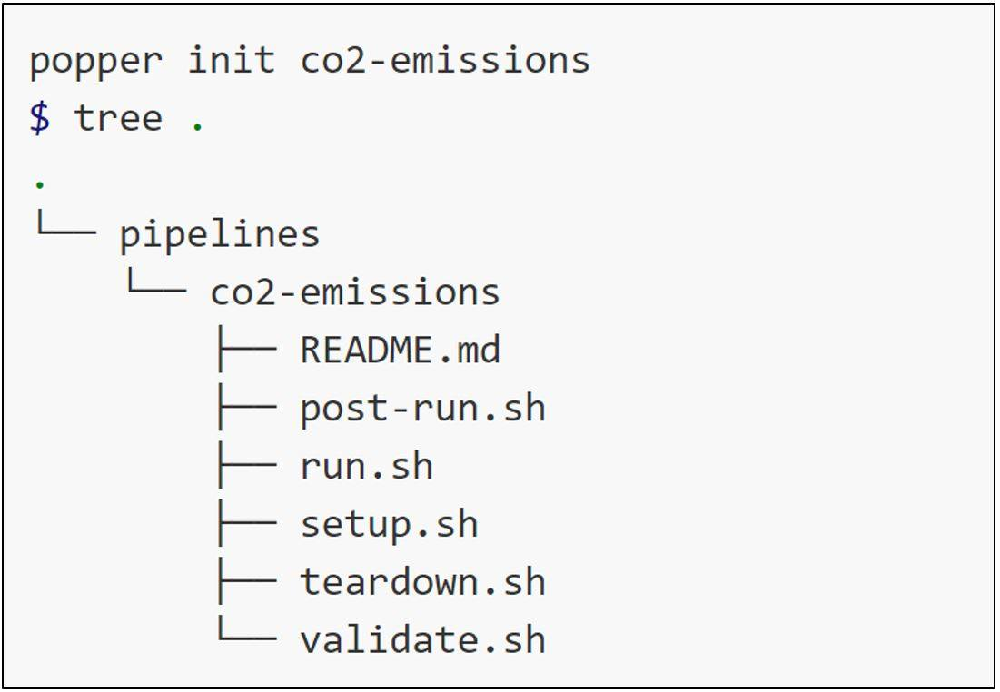

# Introduction
The ability to reproduce previous experiments is one of the most important aspects in scientific research. However, as scientific discovery is rapidly advancing, researchers are pressured to rush publication of new findings and present breakthrough discoveries at conferences. Lately, there has been a growing concern in the research community about results that cannot be reproduced and thus cannot be verified. This is partially due to the lack of incentive for researchers to revoke experiments that were unable to be reproduced [@kurose_2016]. Moreover, replicating scientific experiments in the field of mobile and wireless networks is a challenging task. One of the biggest setbacks of reproducibility is the complexity that comes with rebuilding the same environment in which the original experiment was conducted [@jimenez_2017_popper_ci]. Rerunning an original experiment can be strenuous since extensive configuration and software installation is needed in order to reproduce any experiment. In the scientific community, it is important to be able to reproduce existing research paper results to further improve upon and understand conveyed ideas.

# Related Work

## Before Reproducibility Tools
{#fig:dockerVm}
	
Network simulators were not designed with the concept of reproducibility which makes the automation and configuration of simulations more difficult. Previously, a tool that was commonly used to rerun experiments was a virtual machine. Recently, DevOp tools, such as Docker, became popular for packaging and recreating environments as one package. The base functionality between a virtual machine and Docker are similar in the ability to create an environment for an application. However, these two tools use their own approaches. In a virtual machine you must define an environment per application, whereas in Docker an environment can be shared among other applications where the applications are run in a container. This allows for sharing resources on your host operating system since Docker dynamically allocate memory. Another added feature to Docker is that modules and packages can also be defined when building the environment which prevents having to be careful of how each operating system handles downloading modules such as *pip* for example.

However, in order configure a virtual machine with all of the correct dependencies and environments to replicate an experiment, there is still some ambiguity in terms of the exact settings of the original experiment. Using Docker and packaging an environment with all the extra modules eliminates this ambiguity. @Fig:dockerVm shows the infrastructure of these tools.

## Exisiting Tools
Recently, researchers have started developing tools that aim to make the reproduction of scientific findings simple and undemanding. Sciunit [@sciunit] is one of such tools developed to encapsulate the author’s workflow. It is a command-line tool that saves all dependencies related to executing a command in Linux. Consequently, the command can be later replicated in a different environment without having to obtain the same dependencies related to executing that command.
ReproZip [@repro_zip] is another tool that allows for easy reproduction of experiments using command-line executions. While executing the experiment in its original environment, ReproZip tracks operating system calls and packs necessary components of the experiment into a file. In the unpacking step, ReproZip can reproduce the experiment form that file in another environment.

## Popper
Popper is a convention for creating reproducible scientific articles and experiments  [@jimenez_2017_popper].  The convention is based on open source software (OSS) development model, using the DevOps approach to implement different stages of execution. The Popper Convention creates self-contained experiments that do not rely on libraries and dependencies other than what is already inside the “popperized” experiment. To achieve reproducibility, Popper uses pipelines that contains shell scripts that execute the original experiment. @Fig:popper shows an example Popper pipeline from one of the Popper lessons.

{#fig:popper}

# Network Simulation

## Background
In many network simulations, especially wireless sensor network simulations, Cooja is used as the main tool to conduct experiments. Cooja is a simulation tool for the Contiki open source operating system, which allows simulations of small and large networks. 

### TerrainLOS
One of the experiments that we reproduced in this paper is based on [Sam Mansfield’s paper]. TerrainLOS is an outdoor terrain propagation model that aims to create a more accurate simulation of outdoor sensor network communication. When it comes to simulating sensor networks, terrain plays a significant role in evaluating the performance of network functions. Most simulation platforms, however, either assume a completely flat terrain or tend to use very simplistic channel propagation models that do not represent realistic outdoor terrain conditions. To present a more accurate outdoor simulation model, TerrainLOS uses common geographical height maps, called Digital Elevation Models (DEMs). These data files are used in experimental evaluations to investigate communication between nodes under realistic conditions. TerrainLOS describes the Average Cumulative Visibility (ACV) as a metric to characterize network connectivity over the terrain classified in the DEMs. ACV denotes the percentage of sensor nodes that are visible in an area from all locations on a given map. For example, 100% ACV means that every node is visible from all locations, which further implies the presence of a flat terrain. In the experimental methodology, the authors of TerrainLOS refer to the average number of nodes in an area as the average population, and the average number of nodes that a given node can communicate with is referred to as the average node density. These two metrics are used in determining network connectivity. The experiment focuses on automating the execution and re-execution of one of the experimental simulations performed in the paper, called Experimental Connectivity. This experiment focuses on experimentally evaluating the accuracy of connectivity results based on the models presented in the paper. The connectivity results are plotted using the average cumulative visibility metric and population size.  

### 2.5D Deployment on TerrainLOS
The experiment where this methodology is used on is based on the paper Guiding Sensor-Node Deployment Over 2.5D Terrain [@veenstra_2015]. The idea of this experiment is to initially place nodes on a specified terrain map within a predetermined range. Then using the algorithm from the paper, nodes continually move around the given terrain until a final cumulative visibility value has been computed. As a result, the output of the experiment is a final cvis value where of all of the nodes are placed in a way that maximizes the coverage a given terrain.

The old way the experiment [@veenstra_2015] was conducted was that the experiment would have to start with a GUI, configure a few parameters such as the number of nodes, terrain, and transmitting range, then initial a script, run the script, and wait for final results. For each simulation these manual steps had to done. 

# Popperization

## Background

## TerrainLOS
To run TerrainLOS in COOJA, without using Popper, a user would have to go through the same steps I did when I tried replicating Sam’s results on my computer. First, they would have to download Instant Contiki, install a Virtual Machine to start Contiki. Then, they would have to download all the necessary files and dependencies from Sam’s GitHub page, create a jar file of TerrainLOS, run the simulator, and load it into COOJA. This is a very time-consuming task and the user might even receive error messages when they try to run the project the first time. Using Popper is a much more effortless way to re-execute someone’s experiment without the need to have the original author explain the steps they need to take to run the project. 

In my Popper pipeline, I had two stages – the run stage and the post-run stage. My setup stage was done using Docker, by creating an image of the Contiki operating system including the COOJA simulator in a Dockerfile. In the run stage, I ran Sam’s python script called calc_experimental_connectivity.py that takes ACV and population as it’s input. The run stage runs the experiment with population of 1, 10, 30, and 80, and ACV of 10-100 in increments of ten. The results of these runs will be put into log files. These log files are then read with the graph_max_density_connectivity.py script in the post-run stage. At the end of the run the graph of the experiment will be saved as “Connectivity.png” file under Connectivity. This 3 “popperized” experiment can be now run by just simply using the command “popper check” inside the pipeline.

## 2.5D Deployment on TerrainLOS
When first running the experiment [@veenstra_2015], there were a few tools that had to be downloaded before getting the experiment to work. Java and Contiki had to be installed since those are the environments where the experiment runs. Once the environment was set up, the code for the experiment would run in Cooja. Then for every experiment to be run, a simulation file had to be configured per experiment manually. 

This part of the process can be very lengthy since each simulation contains numerous different parameters. After each simulation script has been configured, each script could be run within the simulator, then after a certain amount of time the final cvis value is obtained which the part of the experiment results.

With the Popper version, there are two stages in the pipeline - the setup stage and run stage. The setup stage builds a Docker container which creates the necessary environment for the experiment to run. Additionally, the setup stage creates simulation scripts for every experiment the user would like to run. In the run stage, each of the scripts that have been made from the setup stage are now run in the Cooja simulator.

Furthermore, in the Popper version the user only has to configure one file for multiple simulations where popper will run each simulation individually and then output the final results. Workflow of automation of experiment: First, the values of the parameters of the experiment have to be defined by the user. Second, a Docker container is created with the entire environment, modules, and packages for the experiment to run. In the third step, the simulation template gets pulled in to the fourth step when creates N amount of simulations that the user has defined. Fifth, those N simulations are run and lastly the Cooja.testlog are outputted into the output folder to further evaluate the final result.

# Results {#sec:results}

## TerrainLOS

## 2.5D Deployment on TerrainLOS
{#fig:origin_veenstra}

{#fig:new_veenstra}

The final output obtained from the experiment is the final cumulative visibility value from the final placement of the nodes according to the specified terrain in the experiment.

In @Fig:origin_veenstra and @Fig:new_veenstra we can see that the results are *not* exactly the same. Some of the reproduced results do not have all of the terrains as in the orginal results because not all of the terrains were available while reproducing the experiment. Furthermore, the values in @Fig:new_veenstra are higher than the values in @Fig:origin_veenstra. This is because the original paper was programmed in C++ and since then the experiment has been  translated into a Cooja environment, which results a difference in the end result.

The main take away from these results, despite some missing elements, is that the trend of both @Fig:origin_veenstra and @Fig:new_veenstra are similar.

# Conclusion {#sec:conclusion}
Researchers usually don’t have the opportunity to reach out to the author of an experiment when rebuilding their work in the environment the original project was built in. This process can be time-consuming and often impossible. The Popper convention offers a very straight forward way to implement reproducibility for scientific research articles.

It is harder to try to make a fully finished experiment reproducible, especially if the person trying to reproduce the experiment is not the original author of that experiment. Reproducibility should be kept in mind at the start of an experiment. Reproducing small sections of the code is easier than trying to reproduce code that has already been completed. 

# References {.unnumbered}

\noindent
\vspace{-1em}
\setlength{\parindent}{-0.18in}
\setlength{\leftskip}{0.2in}
\setlength{\parskip}{0.5pt}
\fontsize{7pt}{8pt}\selectfont

